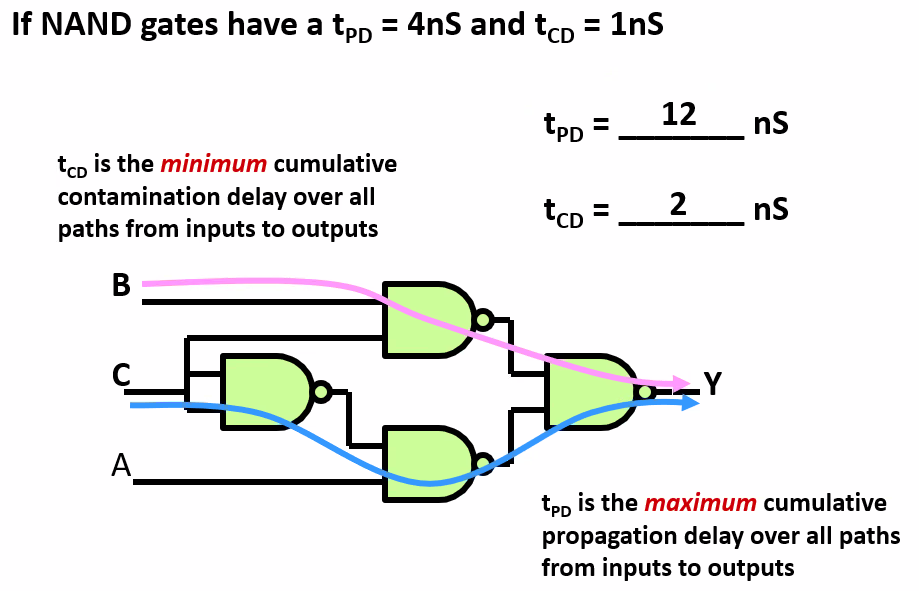
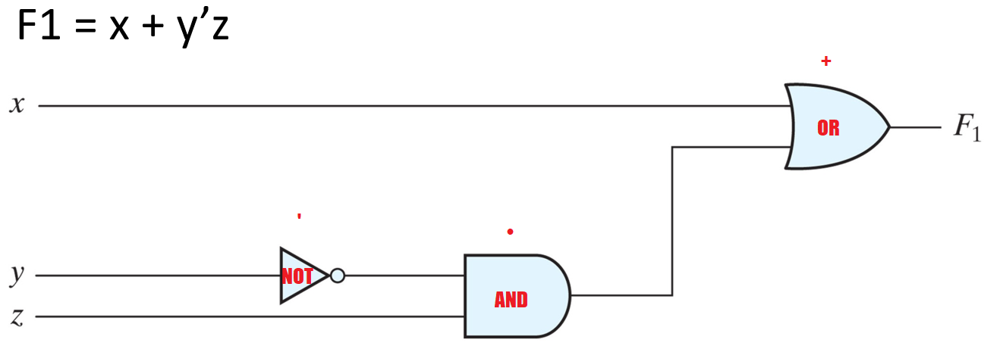
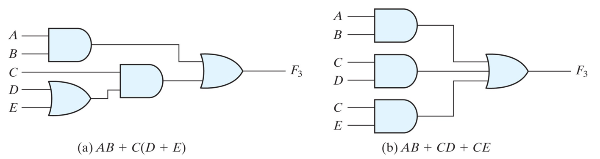
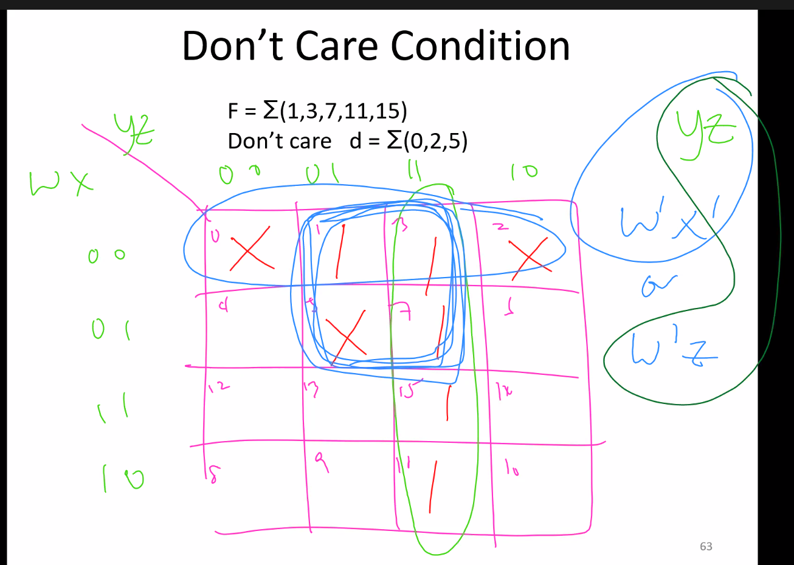

# Digital Systems

<br/>

### Introduction

Only in binary form (boolean algebra), circuits and maths share a relationship. Because of this, gave rise to computers and calculators.

<br/>

#### FPGA vs DSP vs MCU vs ASIC

- ##### MCU - Microcontroller Unit

Arduino

<br/>

- ##### FPGA - Field Programmable Gate Array

With FPGA you have control over the hardware in a software manner. You can upgrade the software.

<br/>

- ##### ASIC (Application Specific Integrated Circuits) 

ASIC is custom manufactured for specific design tasks -- most common is bitcoin mining. If bitcoin crash, then these ASICS are useless and worthless. But they are the best in the field.

<br/>

The cost to build ASIC is very expensive. So you should be prototyping on FPGA before custom building ASIC because it cannot be used for anything else if you do not build properly.

<br/>

When you build thousand or millions of chip, ASIC will be cheaper than FPGA.

<br/>

<br/>

### `HDL` Hardware Description Language

> Examples are like VHDL and Verilog (C-based)

Need to burn into FPGA. These are codes used to describe how the hardware works.

<br/>

<br/>

### Analog Vs Digital

Both have advantages and disadvantages.

<p align="center">
  
</p>
<br/>

<br/>


### Data Compression

- Lossy
- Lossless

>if no info is lost, then lossless, otherwise, if compression makes the file lose some data, its called lossy compresssion.

Analog can be infinite variations of music, whereas digital audio is step-based. But for noise, Analog < Digital.

Analog more susceptible to degradation. Digital audio is portable and reproducible. Can be shared with the entire world through internet.

<br/>

##### Latency

If musician monitoring himself playing, and got latency (lag), then will be confusing for him.

There is inherent noise in analog data.

The more analog processing(copy) we use, the worse the noise gets. When copying old movies, it will get more "zzzz" sounds

all mp3 that are copied preserves all its data.

<br/>

| Analog                          | Digital                                  |
| ------------------------------- | ---------------------------------------- |
| Primitives from physical        | Primitives are boolean functions         |
| Noise from thermal fluctuations | Noise from round-off error               |
| Noise accumulates               | Error does not accumulate through stages |

For round off error, you can use more bits to represent the sound. this means your graph got more "steps"

<br/>

32-bit devices that store time since epoch (a start date to begin recording time) can only store so much info. Afterwards, it cant ever store anymore.

<br/>

This gives rise to :

- Y2K problem


- Y2038 problem

<br/>

## Binary to Decimal and back to Binary

Binary is base 2 while decimal is base 10.

#### Change any number from any base to base 10

<br/>

Example : Convert 235~8~ into base 10

> 5 x 8^0^ +
>
> 3 x 8^1^ +
>
> 2 x 8^2^
>
> = 5 + 24 + 128 = 157

<br/>

Example : Convert 1011~2~ into base 10

>1 x 2^0^ +
>
>1 x 2^1^ +
>
>0 x 2^2^ +
>
>1 x 2^3^
>
>= 1 + 2 + 0 + 8 = 11

<br/>

<br/>

<br/>

#### Converting Decimal~10~ to Binary~2~ 

> Or as I may say, keep dividing by 2 and read the remainders from the bottom up.

Example : Convert 75 into base 2 (binary)

>75 to binary = 1001011
>
>75 ÷ 2 = 37 R 1     ←     LSB
>
>37 ÷ 2 = 18 R 1
>
>18 ÷ 2 = 9   R 0
>
>9 ÷ 2 = 4     R 1
>
>4 ÷ 2 = 2     R 0
>
>2 ÷ 2 = 1     R 0
>
>1 ÷ 2 = 0     R 1     ←     MSB
>
>Read remainders from bottom up and voila!

Where :

- MSB = Most significant bit

- LSB = Least significant bit


&nbsp;


Signed integers : 2's Complement

<br/>

<br/>

<br/>

<br/>

### Using voltages to encode binary values

<p align="center">
  
</p>

There is a gap between the 2 signal range because of noise

this is called a buffer region. so it wont flicker between 2 states. To ensure robust operation we would like to make the noise margins as large as possible.

<br/>

V~OL~ voltage output low

V~OH~ Voltage output High

V~IL~ Voltage input low

V~dd~ Voltage drain drain

<br/>

Inputs must be more LENIENT than outputs to account for noise.

In mathematical terms, in terms of voltage:

<p align="center">
  
</p>

The difference between :

- V~OL~ and V~IL~
- V~IH~ and V~OH~

is called the "noise margin"

<br/>

<br/>

<br/>

#### Propagation Delay (t~PD~)

- Time taken for the circuit to do the computation required (an upper bound) to change from valid low to valid high or vice versa. 

<br/>

- t~PD~ max is add up all the t~PD~. individual t~PD~ can be different.

<p align="center">
  
</p>

the maximum cumulative propagation delay over all paths from input to output

<br/>

<br/>

<br/>

#### Contamination Delay (t~CD~)

lower bound on the delay from invalid input to invalid outputs (aka t~pd,min~)

time taken to change from invalid inputs to invalid outputs

<p align="center">
  
</p>
<br/>


t~CD~ is the minimum cumulative contamination delay over all paths from inputs to outputs

<br/>

<br/>

<br/>

#### Combinational circuits

t~PD~ > t~CD~

total t~PD~ is the MAXIMUM path while total t~CD~ is the MINIMUM path.

<p align="center">
  
</p>


##### Overview of the types of digital circuits

There are only 2 types of digital circuits in the world as of 2021.

1. **Combinational logic**

> does not require state or memory
>
> 
>
> calendar example

2. **Sequential logic**

> requires state and memory
>
> 
>
> Examples : traffic light, rotary lock


week 2 : 

boolean algebra

gate level minimisation


### Boolean Algebra

for a set S, if an element x belong to the set, x ∈ S

for operators , + - x / 

> if x* y = z, then x,y,z ∈ S


associative

commutative

identity

inverse

distributive 


<find a better picture of the boolean algebra laws>


### Boolean Algebra Laws

<p align="center">
  
</p>

<p align="center">
  
</p>


Behold! the 2 most sacred pieces of information from the cheat sheet of yours truly.

Other sacred information from my cheat sheet :

<p align="center">
  
</p>

<br/>

<br/>

<br/>

<br/>

<br/>

#### Boolean Logic

0 is identity wrt +

1 is identity wrt .

<br/>

this means anything + 0 give you back anything

and anything . 1 give you back anything.

<br/>

```
+ = OR  (either must be 1 for output to be 1)
. = AND (must both be 1 for output to be 1)
' = NOT (complement)
```

<br/>

probably wont test you here but should know

<br/>

#### Boolean vs ordinary

- associative law holds for both boolean and ordinary.

  > (2+3)+4 = 2+(3+4)

- Distributive law of + over . is valid for boolean but not for ordinary.

- Boolean algebra does not have - or / operations

- complement no such thing in ordinary algebra

  > complement of 0 is 1
  >
  > complement of 1 is 0

- ordinary algebra deals with real numbers (infinite numbers), boolean only have 1 and 0

<br/>

#### OR gate :

<p align="center">
  
</p>
#### AND gate :

<p align="center">
  
</p>
<br/>

<br/>

### Duality Principle

Duality Principle : Every algebraic expression deducible from the postulates of Boolean algebra remains valid if the operators and identity elements are interchanged.

<br/>

Basically means : If you change OR and AND, you can replace 1 by 0 and 0 by 1, and then everything will still hold.

<br/>

> For example, the terms
>
> x + 0 = x
>
> x . 1 = x
>
> are the SAME.

<br/>

De Morgan's Theorem

> (x + y)' = x'y'			NOT (X OR Y) = (NOT X) AND (NOT Y) 
>
> (xy)' = x' + y'			NOT (X AND Y) = (NOT X) OR (NOT Y)

<br/>

<br/>

<br/>

### Boolean algebra's correlation to circuits

<br/>

<p align="center">
  
</p>

Functionally equal, you can build circuits to solve math problems. This is what is going on in your computers except on a very tiny scale.

<br/>

- Two circuits can have the same inputs and outputs for all possible binary combinations of inputs.
- The one with fewer gates and inputs to gates is preferable because it requires fewer wires and components.
- Sometimes we may want shorter delay
- Most economic representation of the logic is an important design task

<br/>

<br/>

<br/>

##### Truth table

- you usually obtain truth table before building your circuit

<p align="center">
  
</p>

<br/>

<br/>

<minterm maxterm 3 binary variable picture here>

<br/>

<br/>

Minterm / Standard Product (m~0~ to m~7~)

- primed if 0
- unprimed if 1

Basically, xyz must always give an output of 1 for each scenario

<br/>

Maxterms (M~0~ to M~7~)

- primed if 1 
- Unprimed if 0

must always give output of 0 for each scenario


minterms, maxterms are predefined stuff.

Maxterm is the complement of its corresponding Minterm


### Minterm, Maxterm

<br/>

<p align="center">
  
</p>

<br/>

Given a truth table, and how it maps to a function, you will be required to find the sum of minterms / product of maxterms to design your circuit.

<br/>

For examples of minterms and maxterms, we shall be using this truth table complete with function outputs.

<br/>

### Sum of Minterm

<br/>

By seeing where the function results in a "1" in the function, find that corresponding row and build its corresponding minterms. Then "sum" them up by taking the OR of all those terms.

<br/>

<p align="center">
  
</p>

<br/>

2 examples, f1 and f2 in this picture. You may leave the answer in terms of designation m~n~ 

<br/>

### Product of Maxterm

On the other hand, maxterm is just minterm but instead of finding "1" on the function, you find "0" and instead of finding the sum, you find the product, that is; i.e. M1 M4 M7

<br/>

<p align="center">
  
</p>

You may leave the answer in terms of designation M~n~ 

<br/>

<br/>

------

#### Comments 


in exam they will give you truth table, use minterm to get boolean eqn. then from boolean eqn you are supposed to draw circuit


minterms and maxterms always complement each other. one you wanna make it 0, the other you wanna make it 1.


------

<br/>

### Three and Two Level implementation

<br/>

<p align="center">
  
</p>

<br/>

2 level implementation has lesser delay, but number of inputs may not be practical.

<br/>


#### K- Map

you can group the variables according to rows or columns, meaning like a group of all x is 1 or all y is 1. 

`F = x+ y`

<p align="center">
  
</p>

<br/>

3 Variable K-map

<p align="center">
  
</p>


Gray Code

Why must `m0 m1 m3 m2` and not `m0 m1 m2 m3` in terms of column? This is because of gray code.

Your neighboring cell must have a difference of at most 1 bit. eg 01 to 11 is 1 bit difference. While 01 and 10 is 2 bits of difference.


In k Map, you can group 2,4,6,8. Multiples of 2.


<p align="center">
  
</p>


Don't care condition

nothing can provide such input, so its like a wildcard

for example, a 16 table will have more outputs than physically possible.

so just dont care about the ones that cannot be physically possible. So put an X where they are.


<p align="center">
  
</p>

dont cares are wildcards. You can group them if you want, or you can ignore them if you want.

<br/>

<br/>

Example:

<p align="center">
  
</p>


<br/>

#### Universal Building Block

<p align="center">
  
</p>


Gate Delays

Sometimes logic circuits may have glitches. If you do not prepare for them, might cause some hazards.


