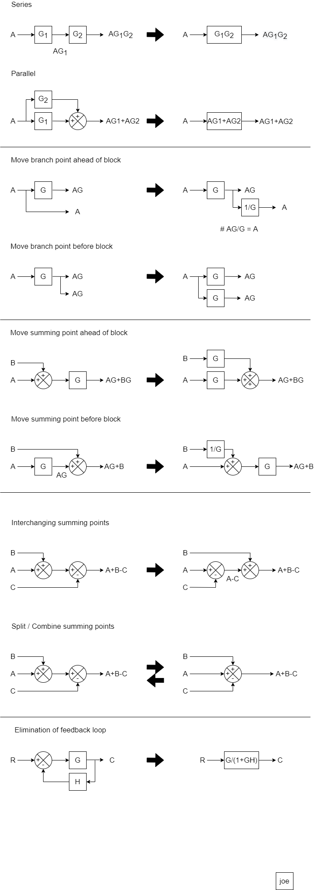
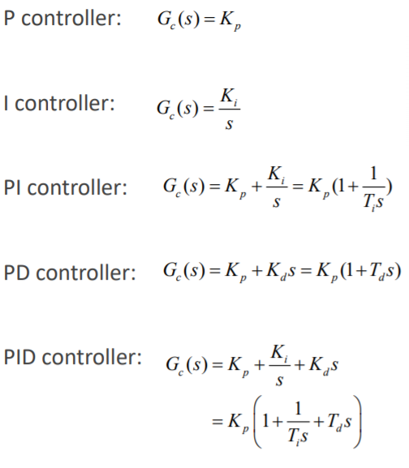
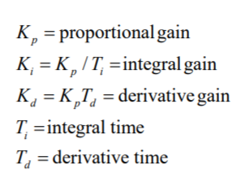
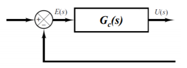

# Block Diagrams

Biggest rule : inputs and outputs **MUST** remain the same after reduction.

  

CR[https://www.youtube.com/watch?v=NUUGOgkOd1A&ab_channel=TutorialsPoint%28India%29Ltd.]

# PID

Proportional, Integral, Derirative

  

where

  

in the feedback loop

  

