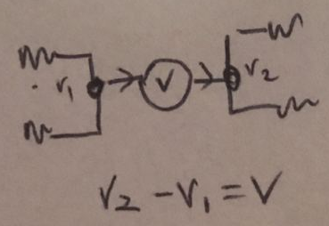

# Circuits

### Superposition

[cr Koh Hui Juan]

basically,
linear systems got 2 properties

1. homogeneity: if x1 output y1 means ax1 outputs ay1
2. additivity: if x1 output y1 and x2 output y2 means x1+x2 output y1+y2

so for linear circuits i.e. if u split a circuit into 3 parts, Vtotal = V1+V2+V3 right cus of the properties
superposition basically splits the circuit up into smaller subcircuits so that it is easier to solve one by one. then after u solve everything alr u add all of them tgt to get the solution.

and the way to split them up is to kill the sources. so each subcircuit only has one source that is on.

then the way to kill sources is to replace voltage source with short circuit (means it become just a wire), then replace current source with open circuit (means that part of the circuit not connected)

### Supernode

Voltage source between 2 nodes.

  

