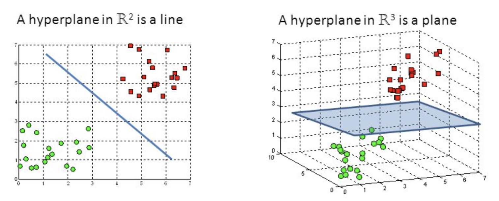
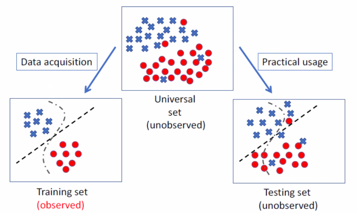
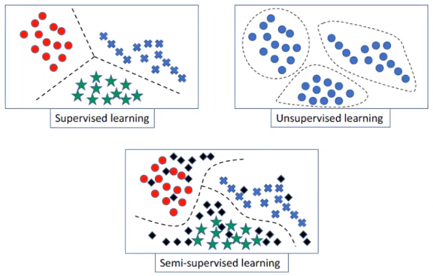
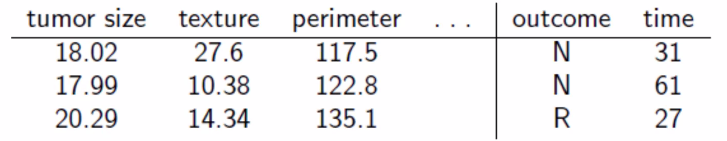
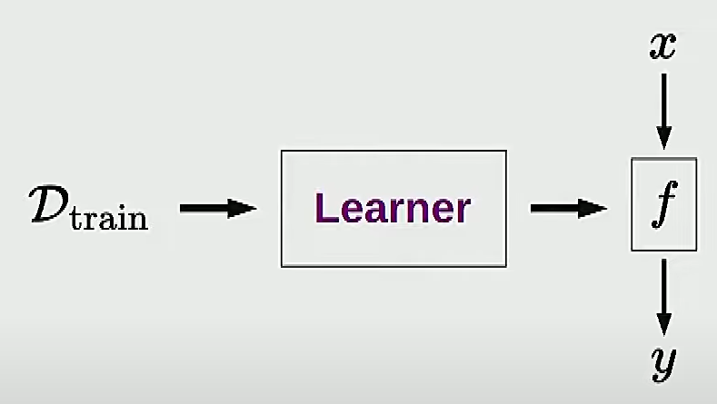
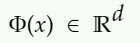
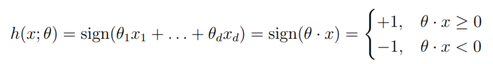
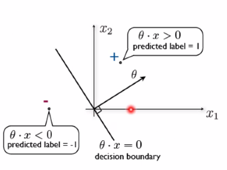
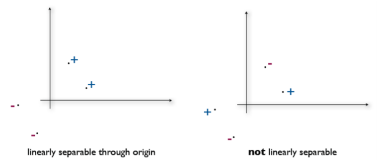

# 50.007 Machine Learning

Algorithms that improve their performance at some task with experience

 

Why study Machine Learning?

- Easier to build a learning system that to hardcode stuff

- Improve on existing programs
- Adaptive based on environment (robustness)

 

learning general models from a data set

 

 

### Table of contents

0. Introduction

   > - General terms and housekeeping
   > - Types of machine learning

1. Linear Classifier
2. Perceptron
3. Hinge Loss

 

 

### General terms and housekeeping

### `Hyperplane`

In geometry, a hyperplane is **a subspace whose dimension is one less than that of its ambient space**. If a space is 3-dimensional then its hyperplanes are the 2-dimensional planes, while if the space is 2-dimensional, its hyperplanes are the 1-dimensional lines.

  

## Introduction

### Training and Testing

Training is the process of making system able to learn

  

- training set and data set has to come from same distribution

- need to make some assumption or bias

 

### Performance

Factors affecting performance

- Quality of data
- Background knowledge (info you already know that you can set zhijie set outliers or account for stuff)
- Type of feedback provided
- Learning algorithm

2 important factors:

- Modelling
- Optimisation

 

### Types of ML

> x~n~ are your inputs, y~n~ are your outputs. 
>
> y~n~ become labels in classification

- Supervised learning ({x~n~ ∈ R^d^ , y~n~ ∈ R} ^N^~n=1~)

  (need human to teach)

  > - Classification [when outputs are discrete values] (need to tell machine this is human, building, dog, cat - each of these are discrete labels)
  >
  > - Regression [when x and y are real values] 
  >
  >   > Best fit line. Recall linear and non-linear best fit lines

- Unsupervised learning ({x~n~ ∈ R^d^} ^N^~n=1~)

  (autonomously extract patterns; PCA to reduce dimensionality for analysis)

  > - Clustering
  >
  >   > K - Means
  >
  > - Probability distribution estimation
  >
  >
  > - Finding association (in features)
  >
  >
  > - Dimension reduction

- Semi supervised learning

  > There is labelled data within your dataset. 
  > First train model with labelled data
  >
  > Then use trained model to predict labels for the unlabelled data

- Reinforcement learning 
  (term is taken from psychology : when robot/dog does correct thing, reward it)
  
  > Decision making

 

Under Supervised learning there are multiple dimensions of classification. This just means that they have different variables to measure by.

1d classification

2d classification

as d increases,  the d in x~n~ ∈ R^d^ also increases.

 

Usually, machine learning will have dimensions easily into the hundreds range, and you can transform them into lower dimensions in order to visualise them.

 

 

##### Passive vs Active learning

- Passive learning is like you feed data into a learner (machine) then it gives you a model.

- Active learners rather are allowed to query the environment. They can ask questions and perform experiments, and are rewarded or punished accordingly.

  

### Classification

Automated methods that are capable of predicting whether something is A or B given a sample of A and B.

##### Classifier

Something that distinguishes A from B. A classifier can be either Linear and Non-Linear.

##### Linear Classifier

A linear classifier is just a line separating 2 sets of variables

non linear classifiers exist as well! it looks like a snek or anything that isn't a straight line

unsupervised learning

### Applications

------

## Supervised Learning

Given a dataset and training sample of tumor size, texture, perimeter (input) and outcome of recurrent or non recurrent and time (outputs)

  

Columns are called input variables or features or attributes

​									h : X -> Y (do math on this)

such that h(x) is a good predictor for the value of y

h is called a classifier

### Steps to solving a Supervised learning problem

1) Decide what the input-output pairs are

2) Decide how to encode inputs and outputs

   > This defines the input space X and the output space Y

3. Choose hypothesis class H (model)

4. Choose an error function (cost function) to define the best hypothesis

5. Choose an algorithm for searching efficiently through the space of hypotheses (optimising)

set of classifiers H : modelling

> Different settings of parameters give different classifiers in the set

robustness : some noisy data may be misclassified. A dog may be classified as a cat by mistake. Too much noise, model cant learn as well. 

##### Binary Classification

e.g. email ∈ {spam, not spam}

you wish to find the function `f` that maps x to y

x → `f` → y ∈ {+1, -1}

##### Regression

(location, year → housing price)

x → `f` → y ∈ ℝ

##### Learning

take a data and produce a predictor so that you can do inference

##### Inference

how do you compute y given x

  

where D_train is dataset

## Linear Classification

##### Feature Vector `Φ(x)`

Originally, features are like, white or black, contains hair or fur, that kind of bs.

Let x denote the original object.

Then it goes to show :

  

For an input x, its feature vector is 

​									Φ(x) = [Φ1(x),... ,Φd(x)]

Firstly, stop thinking of features as properties of input describing your object.

Rather, think of features as mathematical objects now.

so in particular, `Φ(x)` is a point in a high-dimensional space

where d represents the number of features that your object has in the formula Φ(x) ∈ ℝ^d^  

So if you have 2 features, that would be a point in 2d space, 3 features, 3d space, and 100 features, 100d space.

##### Linear Classifier through origin :

  

where :

h is the classifier

x is the input or training data or object of interest

θ is the weights

θ • x is the score

 

sign assigns +1 or -1 depending on whether the score ≥ 0 or not. It is a step function

θ is orthogonal to decision boundary. As I move θ, it moves the decision boundary

  

- When score = 0, the point lies on the decision boundary

- When score > 0, label is 1

- When score < 0, label is -1

This is because θ • x is the score, and sign (score) gives you the classification point.

##### Training Error ???

Linear Classifier that achieves zero training error is called realisable

Definition 1.1  : Training examples S~n~ are linearly seperable through the origin if there exists a parameter vector 

  

##### Summary for Classifiers :

| Name              | Formula                                                  |
| ----------------- | -------------------------------------------------------- |
| Feature Vector    | Φ(x) ∈ ℝ^d^                                              |
| Weight Vector     | w ∈ ℝ^d^                                                 |
| Score             | w • Φ(x) ∈ ℝ^d^                                          |
| Linear Classifier | h(x) = sign (<Score>) = {+1 if score >=0, -1 if score <0 |

## **Perceptron**

**Perceptron update rule**

### **`Theorem 2.1`** 

> **The perceptron update rule converges after a finite number of mistakes when the training examples are linearly separable through origin.**

hence, zero training error can be achieved using the perceptron update rule.

&nbsp;

&nbsp;

Lecture 3 :

## Hinge Loss

training error

loss(...) = [y not equal h] classify whether the point was classified correctly or not

risk R(...) = 1/n sum (x,y) element of loss

linear classifier with offset

training error

zero-one loss

everything thats less than or equal 0 will be 1

for points that lie on decision boundary, is incorrect.

perceptron algorithm

you can update tether values with

when decision boundary gets updated, the point gets correctly classified.

mistake driven algorithm

> only updates itself when mistake is made

perceptron algorithm oscillates and terminates with zero error in linearly separable case.

### Linear classifier - non separable case

perceptron algorithm will not converge nor find the classifier with the smallest error, if its non separable.

training loss / empirical risk

depending on how far it is from y(tether x) it will be penalised. larger mistakes will be penalised more. 

so hinge is like analog while zero one is like digital binary

hinge loss example

og label = -1

prediction score = 0.4 (because of sign function, this means model predicted class as 1)

penalty = max(0, 1+1(0.4)) = 1.4

slide 19 zero weird. its a max function, so the order of zeros dont matter. you take the maximum one from both of the equations anyway. The 0 is there to make sure it cannot be negative. this is because you cannot be more than 100% correct. you do not want to positively reward them. basically stick approach rather than carrot and stick

gradient descent is to find global minima

gradient descent to minimise Rn(tether) 

> Rn = empirical risk

take the gradient and descend on the gradient. So you wanna take the lowest point of the gradient.

- positive gradient is in the direction where Rn(θ) increases

- need to update the weight in opposite direction to minimise error, to hit global minima to get least error possible.

nabla is partial derirative with respect to θ

hinge loss functions are piece wise linear. this means they cannot be differentiated. (?)

##### Stochastic gradient descent (SGD)

1. initialise weights θ = 0

2. select t element of {1,...,n} at random (select a random point)

   > if yt(score) <= 1, then update the weight.

3. repeat step 2 until stopping criterion is met (zero error)

   (e.g. when improvement in Rn(θ) is small enough)

> stopping criterion can be anything - it could be after a certain amount of time, it could be no. of iterations, it could be zero error or when improvement in Rn becomes sufficiently small. You can actually get a better solution before your stopping criterion is reached, so you should be recording your values and what is giving you your best error.

Differences from Perceptron algorithm:

- Near mistakes are also penalised

- Learning rate is decreasing (later updates will be smaller)

  > nk = 1/(k+1)
  >
  > more mistakes you make, more updates and iterations happen, closer you are getting to your minima. give lesser weights to that part of the function. as k increases, fluctuations or updates in decision boundary become less and less.

- 

