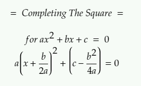
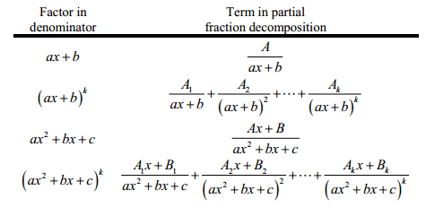

# Algebra & Calculus

*math formulas written in LaTex and compiled by BruttherJOE.*

 

CTS

  

 

Partial Fraction Decomposition

  

[CR: https://www.physicsforums.com/threads/partial-fraction-decomposition-multiple-variables.785797/]

 