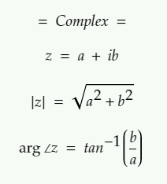
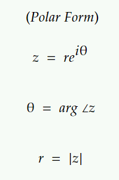
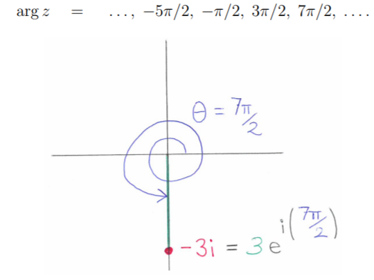
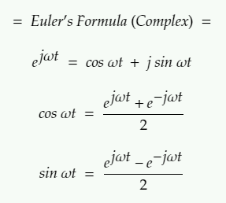

# Complex

Complex numbers are numbers with 2 parts : real and imaginary

where i = √(-1)

Magnitude and arguments

  

Z has many polar forms since there are infinitely many possibilities for the angle θ which is obtained by adding integer multiples of 2π

Principal value of the argument is when the range of angle θ is restricted to -π < θ ≤ π

Euler's Formula

  

