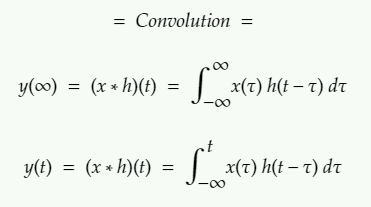
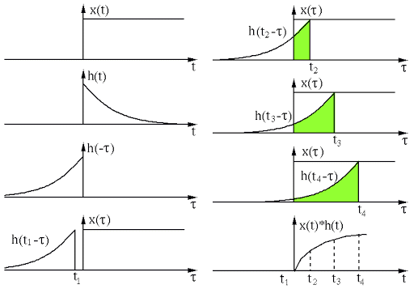

# Convolution

- when you work in laplace transform (S) domain or frequency transform domain, multiplication is convolution in (t) domain.

- operation that takes 2 signals and produces a 3rd signal.


tells us **system output signal** simply based on **input** and **impulse response**


<p align="center">
  
</p>


```latex
latex : 
y(∞) = (x * h)(t) = \int{∞|-∞}x(𝜏) h(t-𝜏) d𝜏
```


note : t is an unknown constant on the x axis in this case. 𝜏 is the variable.

properties : commutative, distributive, associative


x(t) = input

y(t) = output

h(t) = impulse response


There are generally 2 approaches to convolution

1) graphical (draw it, find area x(𝜏) times area h(t-𝜏))

<p align="center">
  
</p>

 [CR http://fourier.eng.hmc.edu/e161/lectures/convolution/index.html]

[note : the link has info on convolutional layers for 2D image processsing!]


2) algebraic (means just zham the formula above, change the limits tho)


