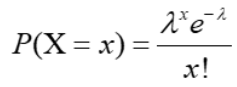
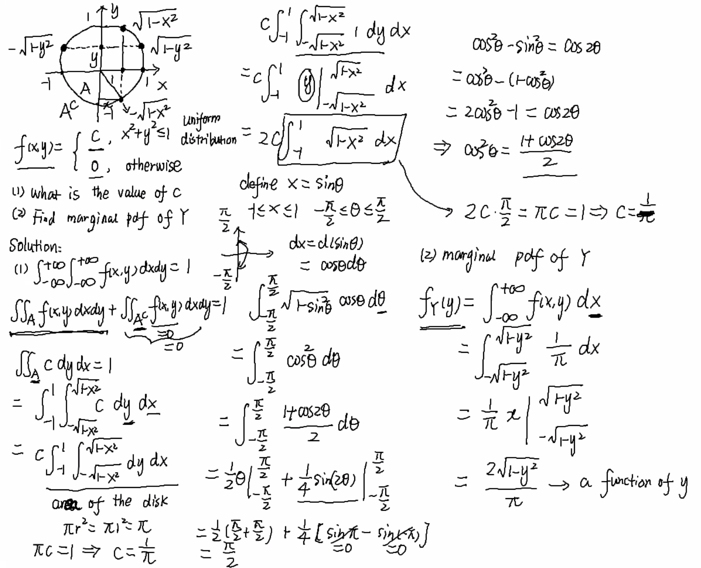

# Probability and Statistics

model of everything : 

var(x) = E(x2) - E(x)2

 

**E(x) and V(x) Manipulations**

Given value of E(x) and V(x) :

E(2x+3) = 2E(x) + 3

V(4x+3) = 42 V(x)

 

For V(z) where z = a function, we are only interested in the multiplier of x; that is, 4x or 2x or 3x, this will be n2 V(x).

 

1) Random Variable (countable) : PMF ( probability mass function) measurable function that associates a  number with each possible outcome in a given sample space

​	discrete RV: PMF probability mass fn p(x) = p(X=x)

​	sum x p(X) = 1

 

2) Continuous random variable (uncountable) : PDF (Probability density Function)

p(a<= x <= b) = ∫b>a f(x) dx

  

### Mean and Variance Table

| Random Variable | Mean (μ) | Variance (σ2) |
| --------------- | -------- | ------------------------ |
| Bernoulli       | p        | p(1-p)                   |
| Geometric       | 1/p      | (1-p)/p2      |
| Binomial        | np       | np(1-p)                  |
| Poisson         | λ        | λ                        |
| Uniform         | (b+a)/2  | 1/12 (b+a)2   |
| Exponential     | 1/λ      | 1/λ2          |

 

 

### Binomial Distribution

The Binomial Distribution Model

shortcut formula : nCx . px . (1-p)n-x

Use of the binomial distribution requires three assumptions:

1. Each replication of the process results in one of two possible outcomes (success or failure),
2. The probability of success is the same for each replication, and
3. The replications are independent, meaning here that a success in one patient does not influence the probability of success in another.

 

`Mean` E(X) = np

`variance` var(x) = np(1-P)

 

### Poisson Distribution

Often used to model the number of occurence of events in a time interval. Eg, number of buses passed by a location from 3pm to 4pm

Probability of x happenning = this formula

λ = avg number of times the event happen in that time period (usually avg per time X time)

Use of the poisson distribution requires 2 assumptions

1. Events are occurring independently
2. Probability that an event occurs in a given length of time does not change through time.

 

poisson with λ = np closely approximates the binomial distribution if n is large and p is small.

 

 

### Normal Distribution

Standardising (number of standard deviations from the mean)

 

if **X~N (µ, σ^2^)**

then **Z = x-µ / σ**

 

##### Standard normal table

 

To use this table : (the typical qn)

1) let **Z = x-µ / σ**

2) solve for Z

lets say Z = 1.75. read 1.7 off the LHS of the table, then find the 0.05 column. 

3) This is your Z value away from 0.5 (as the middle of the standard normal bell curve graph) means this value is between 0.5 and 1.75.

manipulate as needed to get desired value

 

### Exponential Distribution

CDF for Exponential : 

PDF for Exponential : 

λ e^(-λt)^  and also __(refer to notes: exp approx to poisson)

often used to model the elapsed time between two successive events, E.g. the waiting time for a bus.

 

**Memoryless Property** (only applicable to Exponential Distribution!)

Let X be exponentially distributed with parameter λ. Suppose we know X > t. What is the probability that X is also greater than some value s + t? That is, we want to know

`P(X > s + t | X > t)`

More intuitively, If we have a job that’s been running for one hour, what’s the probability that it will continue to run for more than two hours?

Probability that a job runs for one additional hour is the same as the probability that it ran for one hour originally, regardless of how long it’s been running. 

The exponential distribution is memoryless because the past has no bearing on its future behavior. It has the same distribution regardless of how much time has already elapsed. 

The exponential is the only memoryless continuous random variable.

 

 

### Joint Probability Mass Function

2 Discrete RV, X and Y. The joint PMF p(x,y) = p(X=x and Y =y)

joint PMF must satisfy
1) p(x,y) >= 0

2) sumx sumy p(x,y) = 1

typically represented by means of a table or matrix

 

### Marginal PMF

the probability in which X holds a value wrt x

if `px(X)`"marginal pdf of x wrt a X row", they want to see this row (in red) and the other uncircled row in a table.

if `py(y)`"marginal pdf of y wrt a Y column", you draw a table summing up the 4 columns (highlighted in blue)

 

### Joint PDF

X and Y are 2 continuous RV. This means joint PDF f(x,y) is a function satisfying

1) f(x,y) >= 0

2) double integral [∫inf > -inf]  [∫inf > -inf]  f(x,y) dxdy = 1

 

if f(x,y) describes a surface, P[(X, Y ) ∈ A] describes the volume beneath the surface above A.

P[(X, Y ) ∈ A] = ∫b>a ∫d>c f(x, y) dydx

 

### Marginal PDF

fx(x) = ∫inf > -inf f(x,y)dy 

fx(y) = ∫inf > -inf f(x,y)dx

 

Marginal pdf of X is exactly the pdf of X. The word “marginal” indicates that the pdf is obtained from a joint probability distribution. A legitimate marginal pdf must satisfy the same conditions as a pdf. From a joint pdf, we can obtain the marginal pdf of each RV; however, the reverse is not always true.

see annex 1 for interesting problem and solution

 

###### Dependency of pdf

if p(x,y) = p(x) p(y),

it can be said that they are independent. (review last qn of the slides)

 

 

### <u>Distribution Approximation Summary</u>

<u>Rules</u>

Bi ~ Po >>>> ` np ≈ λ`

Po ~ Exp >>>> `λEx ≈ λPo / t`

where `t` is the time period in which `λEx` occurs in

 

 

 

 

# Annex 

some additional supplementary info

annex 1 : integral of marginal pdf if x,y takes values in a circle. Supplementary because it is interesting, but integrals will not be tested for exam.

 

 

 

 

 

[Credits]
1) http://pages.cs.wisc.edu/~dsmyers/cs547/lecture_9_memoryless_property.pdf

2) https://www.mathsisfun.com/data/standard-normal-distribution-table.html

3) SUTD Notes

4) Phoebe Notes